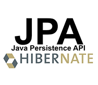

# JPACRUDProject

## Overview
This dynamic web application is used to pull information from a single-table database existing in a MySQL schema, that I created. The table contains Children book data (such as title, author, description, isbn, etc). The database's purpose has a theoretical use for parents wanting to find books for kids learning how to read. There are books in each of four reading levels. There is a web interface which can be used to search for books based on id, or keyword. Another option will show all books in the database. Furthermore, with the option to edit a book and add a user-supplied book to the database, the application can be considered to have a full CRUD impplementation.+   

### How To Run

This project runs using a pre-supplied relational database: childrenbooksdb. Running this project on your own may not be feasible without access to an identical copy and setup of this database. I created this single table MySql database, and as such it should be in the appropriate directory in the github repository where this README was found. Gradle was used for project management and to handle the dependencies, which are located in the build.gradle file. Java was used in order to take advantage of the JDBC API as well as the JSTL library. The Spring Framework will be required to run as well, as Spring specific features are used. Additionally you will need JPA, and more specifically the Hibernate implementation of JPA. Of course, you can also simply download this entire git repository and import it into Eclipse, or possibly other IDEs, and run it there with a tomcat server.

### Technologies Used
* [Java](https://en.wikipedia.org/wiki/Java_) 
* [Object-Oriented design](https://stackabuse.com/object-oriented-design-principles-in-java) 
* [Eclipse](https://www.eclipse.org/ide/) 
* [Git](https://git-scm.com/) 
* [Unix Terminal](https://en.wikipedia.org/wiki/Unix_shell) 
* [MySQL](https://www.mysql.com/) 
* [Spring Framework](https://en.wikipedia.org/wiki/Spring_Framework#Spring_Boot) 
* [MVC / Model-View-Controller](https://en.wikipedia.org/wiki/Model%E2%80%93view%E2%80%93controller) 
* [JPA](https://en.wikipedia.org/wiki/Jakarta_Persistence)) 
* [Hibernate - Framework](https://en.wikipedia.org/wiki/Hibernate_(framework)) 

### Lessons Learned
* How to manipulate data within an SQL server, specifically using MySQL as a relational database management system.
* How to manipulate data with MySQL using using the JPA.
* Better Object Oriented practices in regards to file structure and encapsulation.
* JPA and Jakarta Persistence Query Language and how it differ from MySQL terminal queries.
* Hibernate ORM management using Annotations
* Persistence Entities
* Persistence
* MVC design pattern using Spring.
    * Model
    * View
    * Controller
* Spring Framework Features
    * Beans
    * Command Objects
    * Pojos
    * Annotations
* POST -> Redirect -> GET

### Usage
You can search for a book by its Id or search for a list of book using a keyword. Once a book is displayed, you can view its associated data or you can either choose to delete or edit the book. In the home menu there is an option to create a book as well as to display every book in the database.

### Further thoughts
This project was my second time using Spring and Spring Boot. I am becoming more comfortable with the DispatcherServlet handling all of servlet activity and request mappings, vs having to code each servlet separately and individually. I made frequent use of Post -> Redirect -> Gets. They ensured that if a refresh occurred during certain operations such as while creating a book, that the action would not be executed twice.

This is the second major project where I used the MVC (Model, View, Controller)  pattern. In this case, again, the pattern helped me divide the program's "problem"
or "challenge" into separate easy to digest parts. The pattern also helped me more easily understand the path that data takes through the application and the role each part or component of the pattern plays in getting the data to where it needs to go.

New to my bag of tools this go-around is JPA and Hibernate. I will admit, that these two technologies are areas where I can still learn so much. I barely scratched the surface, but compared to my last MVC CRUD project that didn't have them, they definitely equate to a more refined toolset. JPQL queries are very similar to their MySQL counterparts, but act on the ORM capabilities provided by Hibernate and it's Annotations. They allowed me to bring more of the relational database side into Java land, and that on it's own is always a win for me.

Of course, this project was very simple. One database with one table and a simple CRUD implementation. I look forward to obtaining a more intuitive and deeper understanding of the technologies I am learning. Additionally, I look forward to building on this project's completion and executing more grand and complex projects.
